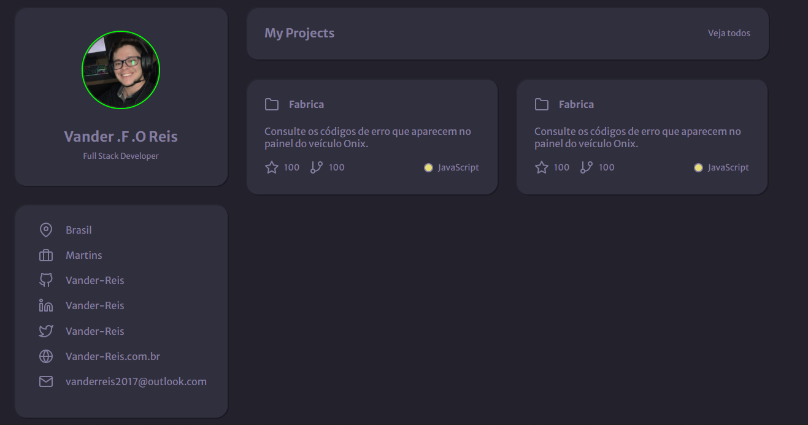

<h1 align="center">
	Projetos discover
</h1>

<h3 align="center">
	Alguns desafios do discover
</h3>

<p align="center">
	
	
	
</p>

<h4 align="center">
	Status: 🚧 Em Construção
</h4>

<p align="center">
	<a href="#tech-stack">Tech Stack</a> •
	<a href="#installation">Installation</a> •
	<a href="#usage">Usage</a> • 
	<a href="#contact">Contact</a> 
</p>

## Tech Stack
&nbsp;
&nbsp;
&nbsp;

## Projects
<center>
	<a href="https://github.com/Vander-Reis/projetos-discover/tree/main/rocketBlog">
		&nbsp;
	</a>
	<a href="https://github.com/Vander-Reis/projetos-discover/tree/main/portfolio">
		&nbsp;
	</a>
</center>

## Installation
To Install this project, follow the steps above:
```bash
$ git clone https://github.com/Vander-Reis/projetos-discover/
```

## Usage
To use this project, follow the steps above:
```bash
Para executar basta rodar o projeto em localhost
```

## Contact


Made with ❤️ by [Vander Reis](https://github.com/Vander-Reis), enter in contact!

<a href="mailto:vanderreis2017@outlook.com" target="_blank"></a>&nbsp;
<a href="https://www.linkedin.com/in/https://www.linkedin.com/" target="_blank"></a>&nbsp;

<br clear="left"/>
